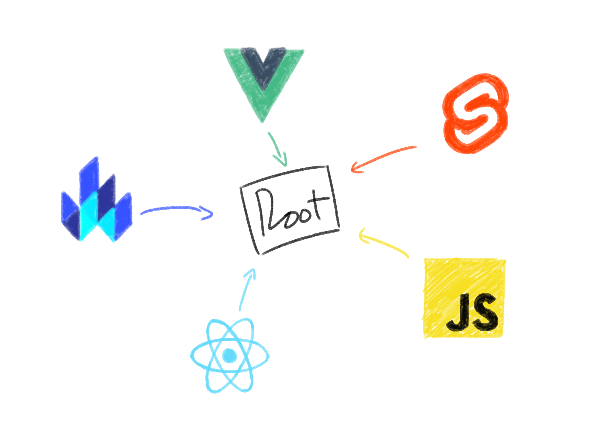

# Micro Frontend & Module Federation feat. JS and Webpack 5

 

## Module Federation
- Allows JS app to dynamically load code from another app.

- Introduced in webpack 5.

- Module shared can be functions, classess, etc.

- Federated code can always load it's dependencies, but will attempt to use consumer's dependencies first.

## Micro Frontend
- Composing frontend using component built by different teams.

- Using Module Federation to share frontend codes.

- Preferably must be framework agnostic.

- Preferably musn't share much state across components.

- Component styles must be centered either in host/root or module.

## Pros
1. Reusability

2. Increased delivery speed

3. Scalability

4. Tech Agnotisticism

5. Decoupling

6. Maintenance

7. Fault tolerance

## Cons

1. Increased complexity

2. Larger payload

3. Inconsitencies in design

4. No standards

## Common Principles

1. Domain Driven Design (DDD) approach

2. Share nothing